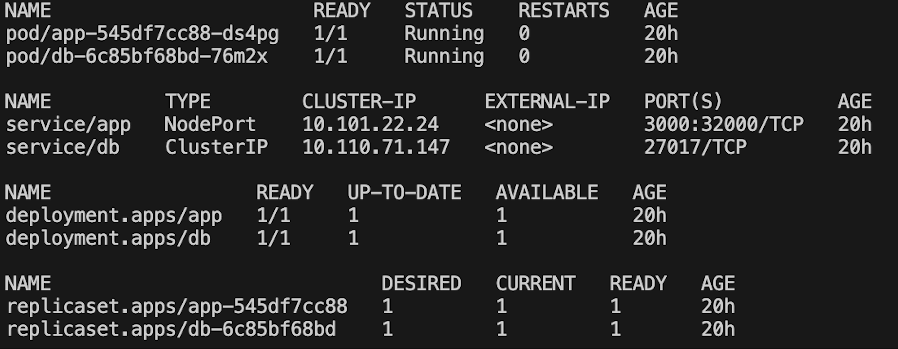
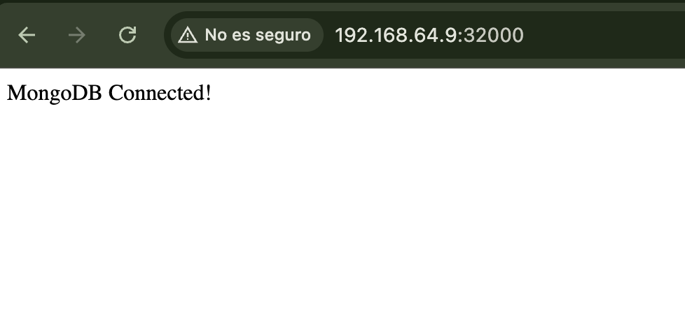
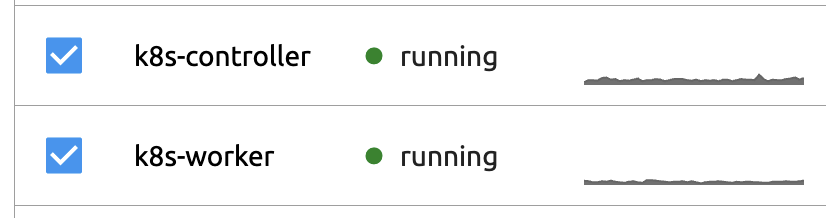
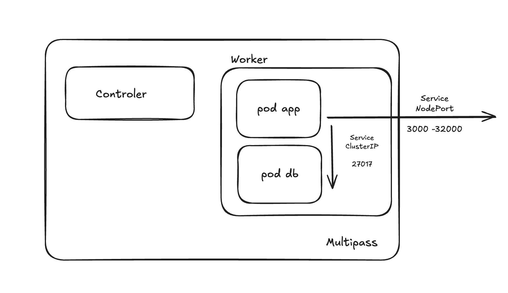

# Desafío 8 — NestJS + MongoDB en Kubernetes (basado en Desafío 5)

Este documento resume exactamente lo realizado:
- Infra con ansible-k8s (Multipass + k0sctl).
- Instalación de kubectl y k0s.
- Reutilización del Dockerfile del Desafío 5: build y push a Docker Hub.
- docker-compose actualizado para usar la imagen de Docker Hub.
- Conversión a manifiestos de Kubernetes con Kompose.
- PV creados previamente para la base de datos.
- Despliegue con kubectl apply.
- Service de la app en NodePort para acceso desde la máquina host.

---

## Requisitos 
- Multipass, kubectl, k0sctl, Kompose, pipx/ansible y ansible-k8s

## 1) Imagen de la app (desde Desafío 5)
Construí y publiqué en Docker Hub la imagen que hice para la app del desafío 5 y actualicé su referencia en el docker-compose.yaml:
```bash
docker build -t lucasmleone/app-template-nestjs:latest .
docker login
docker push lucasmleone/app-template-nestjs:latest
```

## 2) Convertir docker-compose a K8s con Kompose
(ya en el repo bajo la carpeta kompose/)
```bash
kompose convert -f docker-compose.yaml -o kompose/
```

## 3) Persistencia para Mongo
Crear el namespace y aplicar los PersistentVolumes desde un manifiesto:
```bash
kubectl create ns kompose
kubectl apply -f kompose/pv-definitions.yaml    # PVs (cluster-scope)
```

## 4) Despliegue en Kubernetes
```bash
kubectl apply -n kompose -f .
kubectl get pods,svc -n kompose
```
El Service de la app está en NodePort 32000.

## 5) Acceso y verificación
Obtener la IP del controlador y probar:
```bash
multipass list    # tomar IP de k8s-controller
curl http://<IP_CONTROLADOR>:32000/health
kubectl logs -n kompose deploy/app
kubectl logs -n kompose deploy/db
```

## Evidencias




## Diagrama
